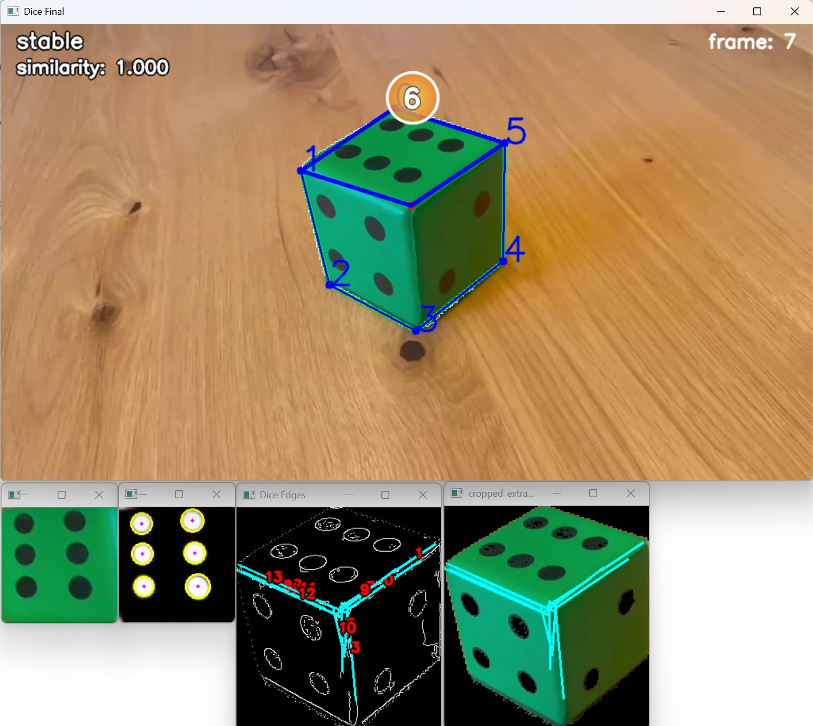
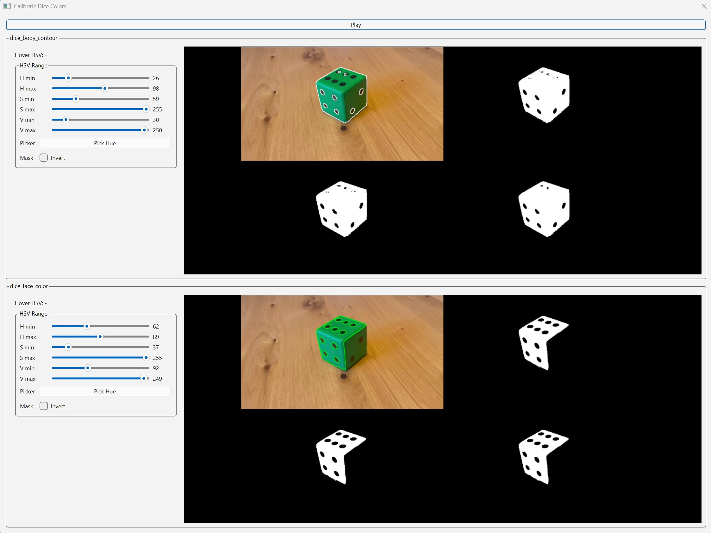

# Dice Pose Estimation and Dot Counting

Estimates the top face of the dice and counts its dots.  
  
Click [here](https://youtu.be/X2E6Y16pKWw) to see a longer and larger version on YouTube:


# Algorithm

1. **Dice body segmentation**
   - The calibrated `dice_body_contour` range is used to mask the dice and extract its largest contour.
   - `cv2.approxPolyDP()` converts that contour into polygon points.

2. **Contour repair**
   - Rounded corners and missing edges often produce incomplete polygon outlines.
   - Parallel edge groups and Hough lines are used to insert missing points and recover a 6-point cube outline.

3. **Top-face estimation**
   - Ray intersections and Hough line evidence choose the most plausible top face from the 6-point outline.
   - The selected top-face corners are warped into a square top-down view with a homography in order to make the dots as circular as possible for the `cv2.HoughCircles()` algorithm.

4. **Dot counting**
   - The warped top face is masked with `dice_face_color` and inverted so the dark dots become foreground.
   - `cv2.HoughCircles()` counts the visible dots.

5. **Temporal stabilization**
   - Frame-to-frame contour similarity estimates whether the dice is stable.
   - A count must repeat for several frames before it is displayed.
   

# Debug Mode
Debug mode shows the intermediate geometry and masks used by the pipeline:
- current frame number, tracking state, and contour similarity score
- detected dice contour and approximated/repaired corner points
- selected top-face outline and intersection point
- separate windows for the cropped edge/Hough-line view, warped top face, and blurred dot mask
  


# How to use it on a dice with different colors
Currently things are setup for that specific green dice. If you want to run it on a different dice or a different lighting
setup, run
``` batch
python setup/calibrate_colors.py
```
This opens the following UI:  
  
It makes you choose 2 colors. Both colors are main color of the dice (green in this case), but in the upper part 
(*dice_body_contour*), focus on getting a nice contour, he'll need that to estimate the geometry.  
In the lower part (*dice_face_color*) adjust the sliders so the dots on the top face have strong black contours. This
is needed for the actual dot counting


# Difficulties
One of the main challenges was dealing with the noisy output produced by several OpenCV functions. 
In particular, `cv2.approxPolyDP()` often returns many points that don't correspond to actual corners. 
This issue was further complicated by the rounded edges of the dice, which caused some real corners to be 
missed entirely.  
Despite the unreliable corner detection, the dot-counting stage proved to be relatively robust. Since the 
dots are positioned closer to the center of each face rather than near the edges, the algorithm remained 
reasonably tolerant to inaccuracies in the detected contours and corner positions.


# Known Issues
- The detector currently relies on HSV color segmentation, making it sensitive to lighting conditions. 
To partially compensate for this, the setup utility `setup/calibrate_colors.py` can be used to recalibrate 
the color ranges for different environments.

- Due to the noisy top-face detection, some frames may be classified one or two points higher or lower than 
the correct value. In practice, this is often corrected automatically because the algorithm only accepts a 
result after it has remained stable for several consecutive frames. This works well with a moving camera, 
where changing perspectives help correct temporary misclassifications. With a static camera setup, however, 
incorrect classifications may persist for longer periods.

- The current implementation can become unreliable when objects with colors similar to the dice are present 
in the scene, as they may interfere with the color segmentation stage.


# Ideas for Improvement

- Additional work could be done on the top-face detection stage to make it even more reliable under difficult viewing 
angles and lighting conditions.

- The color segmentation pipeline could be improved to adapt automatically to changing lighting conditions 
instead of requiring manual recalibration.

# Install

**1. Install Python packages**
```powershell
pip install -r requirements.txt
```


## Run

```powershell
python run.py
```


## Use of AI

AI-assisted development tools (primarily Codex) were used throughout the project to accelerate implementation, 
refactoring, and boilerplate generation.

Core algorithmic design, system integration, and debugging were performed mostly manually. 
Some utility modules, geometry helpers, visualization code and setup files were heavily AI-assisted and subsequently reviewed/modified.
